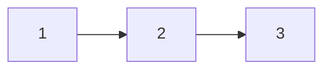
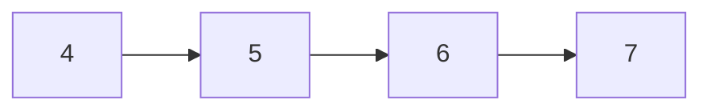
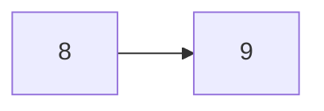

# 算法

- [算法](#算法)
- [复杂度](#复杂度)
  - [时间复杂度](#时间复杂度)
  - [（额外）空间复杂度](#额外空间复杂度)
  - [常数时间](#常数时间)
  - [最优解](#最优解)
- [排序算法](#排序算法)
  - [选择排序](#选择排序)
  - [冒泡排序](#冒泡排序)
  - [插入排序](#插入排序)
- [二分](#二分)
  - [找中点（小结）](#找中点小结)
  - [顺序数组中查找某数](#顺序数组中查找某数)
    - [版本0：至少一个数（recursive）](#版本0至少一个数recursive)
    - [版本1：至少一个数（iteractive）](#版本1至少一个数iteractive)
    - [版本2：至少两个数（iteractive）](#版本2至少两个数iteractive)
  - [有序数组大于等于某数最左的位置](#有序数组大于等于某数最左的位置)
  - [局部最小值](#局部最小值)
- [异或^](#异或)
  - [交换两数](#交换两数)
  - [打印出现奇数次的数](#打印出现奇数次的数)
  - [提取一个数最右侧的1](#提取一个数最右侧的1)
  - [两种出现奇数次的数](#两种出现奇数次的数)
  - [一种数出现k次，其他数都出现了m次](#一种数出现k次其他数都出现了m次)

# 复杂度

## 时间复杂度

最差情况的表达式，且只要最高阶项

$$
O(f(n))
$$

## （额外）空间复杂度

在算法流程中需要开辟多少额外空间，最差情况

返回一个拷贝数组，额外空间复杂度为
$$O(1)$$

## 常数时间

需要对自己的语言足够了解

```c
//加减乘除
a*b;
a+b;
a/b;
a-b;

//位运算
a>>1
a<<1
a|b
a&b
a^b

//赋值，比较，自增自减
a = 2;
a<b
a++;
++a;

//数组寻址
int a[10000];
a[k];
```

## 最优解

时间复杂度尽量低，空间复杂度优秀，但最优解不包括**常数时间**复杂度

| rank | $O(f(N))$           |
| ---- | ------------------- |
| 1    | $O(1)$              |
| 2    | $O(log(N))$         |
| 3    | $O(N)$              |
| 4    | $O(N\cdot{log(N)})$ |
| 5    | $O(N^2)$            |
| 6    | $O(N^k)$            |
| 7    | $O(2^N)$            |
| 8    | $O(3^N)$            |
| 9    | $O(k^N)$            |
| 10   | $O(N!)$             |

# 排序算法

## 选择排序

$$
O(N^2)
$$


```c
void select_sort(int array[], int length){
    //优化if(length < 2 || array == NULL)
    if (length == 0 || length == 1){
        return;
    }
    if (array == NULL){
        return;
    }

    for (int i=0;i<length-1;i++){
        int index_min = i;
        for (int j=i+1;j<length;j++){
            //优化index_min = array[j] < array[index_min] ? j : index_min;
            if (array[j] < array[index_min]){
                index_min = j;
            }
        }
        swap(array, i, index_min);
    }
}

void swap(int array[], int i, int j){
    if (i == j){
        return;
    }
    int temp = array[i];
    array[i] = array[j];
    array[j] = temp;
}
```

## 冒泡排序

$$
O(N^2)
$$


```c
void bubble_sort(int array[], int length){
    for (int i=length-2;i>=0;i--){
        for (int j=0;j<=i;j++){
            if (array[j] > array[j+1]){
                swap(array, j, j+1);
            }
        }
    }
}

void swap(int array[], int i, int j){
    if( i == j){
        return;
    }
    int temp = array[i];
    array[i] = array[j];
    array[j] = temp;
}
```

## 插入排序

排序过程类似**斗地主**，左手抓一叠已经排好序的牌，右手捏着一张新牌，从高位向低位依次比较交换，插入合适的位置

$$
最差情况O(N^2)
$$


```c
void insertion_sort(int array[], int length){
    if (length < 2 || array == NULL){
        return;
    }

    for (int i = 1; i < length; i++){
        //参照系为绿色方块，i指向绿色方块
        int j = i - 1;
        while(j >= 0 && array[j] > array[j+1]){
            //记住不能在i循环内修改i变量的值
            swap(array, j, j+1);
            j--;
        }
    }
}

void swap(int array[], int i, int j){
    if( i == j){
        return;
    }
    array[i] = array[i] ^ array[j];
    array[j] = array[i] ^ array[j];
    array[i] = array[i] ^ array[j];
}
```

# 二分

$$O(N) -> O(log(N))$$

>一般以2为底默认log(N)表示

## 找中点（小结）

$$len_{array} = index_{end} - index_{begin} + 1$$


图中的1，2，3都是指index，如果取中点时的两端的index**相差偶数**，做去尾除法的结果是**正中心**的元素
$${{1+3}\over 2} = 2$$


如果两端index**相差奇数**，取中点时落在中间偏左侧的位置，这是C语言**去尾除法**的结果
$${{{4+7}\over{2}} = 5}$$


如果index相邻，和情况二一致
$${{{8+9}\over{2}} = 8}$$

## 顺序数组中查找某数
>if语句里不能直接比较mid和target，应该比较array[mid]和target

### 版本0：至少一个数（recursive）

```c
int binary_search(int array[], int target, int p, int q){
    if(p > q){
        return -1;
    }
    int mid = (p + q) / 2;
    if (array[mid] > target){
        return binary_search(array, target, p, mid - 1);
    }
    else if (array[mid] < target){
        return binary_search(array, target, mid + 1, q);
    }
    else{
        return mid;
    }
}

```

### 版本1：至少一个数（iteractive）
```c
int binary_search(int array[], int length, int target){
    int p, q;
    p = 0;
    q = length - 1;
    while(p <= q){
        //至少一个数
        int mid = (p + q) / 2;
        //mid = p + ((q - p) >> 1);
        if (array[mid] == target){
            return mid;
        }
        else if(array[mid] < target){
            p = mid + 1;
        }
        else{
            q = mid - 1;
        }
    }
    return -1;
}
```

### 版本2：至少两个数（iteractive）

```c
int binary_search(int array[], int length, int target){
    int p, q;
    p = 0;
    q = length - 1;
    while(p < q){
        //至少两个数
        int mid = (p + q) / 2;
        //mid = p + ((q - p) >> 1);
        if (array[mid] == target){
            return mid;
        }
        else if(array[mid] < target){
            p = mid + 1;
        }
        else{
            q = mid - 1;
        }
    }
    return target == array[p] ? p : -1;
}
```

## 有序数组大于等于某数最左的位置

在每次求中点之后，维护temp记录当前最左的大于等于x的index

二分到结束

```c
int exist(int array[], int length, int target){
    int p = 0;
    int q = length - 1;
    int temp = -1;
    while(1){
        if (p >= q){
            return array[p] == target? p: temp;
        }
        int mid = (p + q) / 2;
        //mid = L+((R - L) >>1);
        if (array[mid] >= target){
            temp = mid;
            q = mid - 1;
        }
        else{
            p = mid + 1;
        }
    }
}
```

## 局部最小值

在一个无序数组中，任意两个不相邻的数不相等，求该数组的一个局部最小

```c
int get_less_index(int array[], int length){
    if (length <= 2){
        return -1;
    }

    if (array[0] < array[1]){
        return 0;
    }
    if (array[length-1] < array[length-2]){
        return length-1;
    }

    int p, q;
    p = 0;
    q = length - 1;

    while(p<q){
        mid = p + ((q - p) >>2);
        if (array[mid] > array[mid-1]){
            q = mid - 1;
        }
        else if(array[mid] > array[mid+1]){
            left = mid + 1;
        }
        else{
            return mid;
        }
    }
    return p;
}
```

# 异或^

异或运算：相同为零，不同为一，

$$
0xorN = N
$$

$$
NxorN = 0
$$

**无进位相加**
交换律
$$AxorB = BxorA$$
结合律
$$(AxorB)xorC = Axor(BxorC)$$

## 交换两数

```c
//a和b不能地址相同
a = a ^ b;
b = a ^ b;
a = a ^ b;
```

## 打印出现奇数次的数

该数只出现一次

```c
int eor = 0;
for(int i=0;i<length;i++){
    eor ^= array[i];
}
return eor;
```

## 提取一个数最右侧的1

```c
a&((~a)+1)
a&(-a)
```

## 两种出现奇数次的数

```c
for (k = 0; k<length;k++)
    eor ^= array[k];

//取eor最右侧不为0的数
int diff = eor&(-eor);

//对array重新分组（diff位为1的数，diff位为0的数）
int eor_ = 0;
int eor__ = 0;
for (j = 0; j<length;j++){
    if (diff & array[j] != 0){
        //该位不为0的数
        eor_ ^= array[j];
    }
    else{
        //该位为0的数
        eor__ ^= array[j];
    }
}

printf("%d", eor_);
printf("\n%d", eor__);

```

## 一种数出现k次，其他数都出现了m次

M>1, K<M找到出现了K次的数，O(N)，额外空间复杂度O(1)